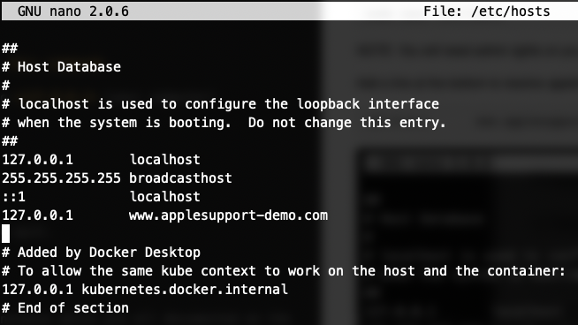

# ServiceNow Engagement Messenger Demo

Engagement Messenger is a new feature of the Quebec release of ServiceNow. It allows you to embed a messenger-like popup inside any website to interact with ServiceNow features, such as browsing knowledge, creating a case, and interacting with Virtual Agent.

Given it is meant for external websites, this app was created to assist you in simulating this experience whist using Engagement Messenger.


### Pre-requisites
* Install Git from [https://git-scm.com/downloads](https://git-scm.com/downloads)
* Install Docker from [https://docs.docker.com/get-docker](https://docs.docker.com/get-docker)

## Getting the Demo

### Open Terminal

Open a Terminal window. It should open in your home directory by default, but you can run the command `cd ~/` if it hasn't.

### Clone this Repository

Execute the following command to clone this repository into a folder

```
git clone https://github.com/dylanlindgren/servicenow-em-demo.git
```

You will now have the `servicenow-em-demo` folder inside your home directory.

## Preparing the Demo

### 1) Take a Screenshot

Inside the  `servicenow-em-demo` folder you will see a `background.png` file. This is the file that is used as the background image of the demo page.

You will need to take a screenshot of the portal/website that you are proposing Engagement Messenger be embedded into — for example, the support page of a customer's existing website.

Firefox has a great tool for taking screenshots, easily allowing you to take one of the entire scrolling area of the page. You can find instructions on how to do this here: [https://www.wikihow.com/Take-a-Screenshot-on-Firefox](https://www.wikihow.com/Take-a-Screenshot-on-Firefox).


### 2) Set Your Background Image

Once you have your screenshot, replace the `background.png` file inside this directory with it.

### 3) Configure Your Hosts File

The demo will be running from your local computer. To make the demo especially impactful, you might want to modify your hosts file so that page looks like that of the customer.

For example, for *Apple* you might want the demo to appear like it's coming from *applesupport.com*.

In terminal, open your hosts file for editing using the following command:

```
sudo nano /etc/hosts
```
*NOTE: You will need admin rights on your machine to run this command*

Add a line at the bottom to resolve *applesupport.com* to *127.0.0.1* (your computer)

```
127.0.0.1       www.applesupport-demo.com
```



Press `CTRL + O` to save the file, and then `CTRL + X` to quit.


### 4) Configure ServiceNow

There are a number of steps required on the ServiceNow instance which are all documented on the ServiceNow Docs website.

1. [Configure an Engagement Messenger module](https://docs.servicenow.com/bundle/quebec-customer-service-management/page/product/customer-service-management/task/create-engagement-messenger-module.html) - Take a note of the Sys ID of the Module as we will use this in the next step. *NOTE make sure you activate this record! (by default it will be "Inactive")*
2. [Configure CORS rule for Engagement Messenger](https://docs.servicenow.com/bundle/quebec-customer-service-management/page/product/customer-service-management/task/create-cors-for-rest-api-ec.html) - Set this to the full address we will be accessing the demo on. For example: `http://www.applesupport-demo.com`
3. [Create HTTP response headers for Engagement Messenger](https://docs.servicenow.com/bundle/quebec-customer-service-management/page/product/customer-service-management/task/create-http-response-headers-for-ec.html) - You can set this `Content-Security-Policy` header value to `frame-ancestors 'self' *`
4. [Configure the Virtual Agent System Properties](https://docs.servicenow.com/bundle/london-performance-analytics-and-reporting/page/administer/virtual-agent/task/embed-va-standalone-client.html) - (You can set the value of the `com.glide.cs.embed.csp_frame_ancestors` system property to `'self' *`)

### 5) Configure the Demo

Open the `.env` file inside the `servicenow-em-demo` folder. By default it will look like this:

```
SN_EM_MODULE_ID=60c794c3db862010b7c8dacbd39619fe
SN_EM_INSTANCE_NAME=dl3
SN_EM_PORT=80
```

Just replace the value of `SN_EM_MODULE_ID` with the Sys ID of your Engagement Messenger module, and the value of `SN_EM_INSTANCE_NAME` with the name of your instance and save the file.

## Running the Demo

Simply run the following command in your `servicenow-em-demo` folder to **start** the demo:

```
docker-compose up -d
```

You can now open your web browser, navigate to the URL of the demo (e.g. `http://www.applesupport-demo.com`) and the demo will be working!

To **stop** the demo, from your `servicenow-em-demo` folder run the following commmand:

```
docker-compose down
```

## Additional Notes

By default the app runs on port `80`, which means that it can be accessed without needing to specify it in the url (e.g. you don't need to type in `http://www.applesupport-demo.com:80`, you can just type in `http://www.applesupport-demo.com`).

Port 80 is a common port though, and if you already have something running on that port you might need to change it to another port such as `8084`. To do this, just update the `SN_EM_PORT` value in the `.env` file inside the `servicenow-em-demo` folder to the port you want it to run on. You will also need to update the CORS rule (from step 4) to include the port as well.